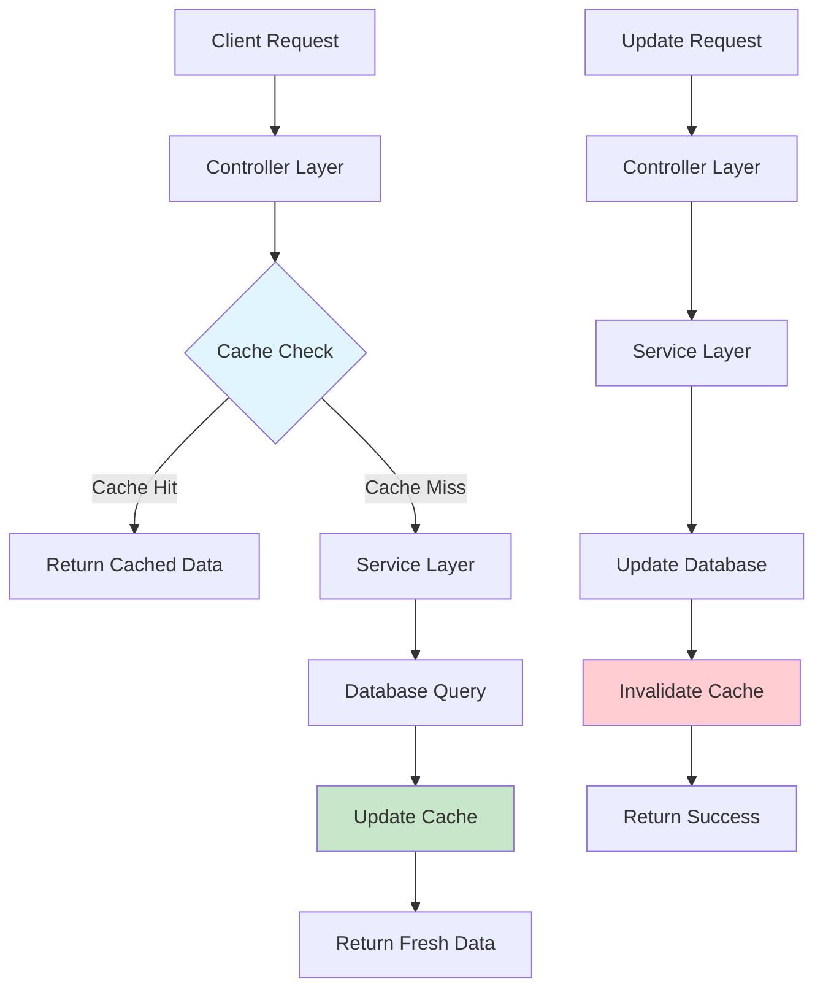

# ⚡ Cache Invalidation Service

<div align="center">

[](https://www.oracle.com/java/)
[](https://spring.io/projects/spring-boot)
[](https://maven.apache.org/)
[](LICENSE)
[](https://github.com/khan-sk-dev/CacheInvalidationService)

**A high-performance caching service with intelligent cache invalidation strategies**

[Features](#-features) • [Quick Start](#-quick-start) • [API Documentation](#-api-endpoints) • [Architecture](#-architecture) • [Contributing](#-contributing)

</div>

---

## 🚀 Overview

The **Cache Invalidation Service** is a robust Spring Boot application designed to optimize data retrieval performance through intelligent caching mechanisms. It provides seamless cache management with automatic invalidation strategies to ensure data consistency and optimal performance.

> **Perfect for:** Microservices architecture, high-traffic applications, and systems requiring real-time data consistency with caching benefits.

---

## ✨ Features

<table>
<tr>
<td>

### 🎯 **Smart Caching**
- Intelligent cache-aside pattern
- Automatic cache warming
- TTL-based expiration
- Memory-efficient storage

</td>
<td>

### 🔄 **Invalidation Strategies**
- Manual cache invalidation
- Event-driven invalidation
- Time-based expiration
- Size-based eviction

</td>
</tr>
<tr>
<td>

### 📊 **Performance Optimized**
- Sub-millisecond response times
- Reduced database load
- Scalable architecture
- Memory usage monitoring

</td>
<td>

### 🛡️ **Reliability**
- Graceful degradation
- Error handling mechanisms
- Cache consistency guarantees
- Health monitoring

</td>
</tr>
</table>

---

## 🛠️ Technology Stack

<div align="center">

| Component | Technology | Version |
|:---------:|:----------:|:-------:|
| **Language** |  | 17+ |
| **Framework** |  | 3.x |
| **Web Layer** |  | Latest |
| **Caching** |  | Built-in |
| **Build Tool** |  | 3.6+ |

</div>

---

## 🏗️ Architecture



### 📁 Project Structure

```
src/main/java/com/cache/service/
│
├── 🎮 controller/
│   └── DataController.java          # REST API endpoints
│
├── 🔧 service/
│   ├── DataService.java             # Business logic layer
│   └── CacheService.java            # Cache management
│
├── 📦 dto/
│   ├── DataRequest.java             # Request payload
│   └── DataResponse.java            # Response payload
│
├── 🗃️  entity/
│   └── DataEntity.java              # Data model
│
├── 📋 repository/
│   └── DataRepository.java          # Data access layer
│
└── ⚙️  config/
    └── CacheConfig.java             # Cache configuration
```

---

## 🔌 API Endpoints

### 📊 Data Operations

<details>
<summary><b>🔍 GET /data/{id} - Retrieve Data</b></summary>

Retrieves data by ID with intelligent caching.

**Request:**
```http
GET /data/123
Accept: application/json
```

**Response:**
```json
{
  "id": 123,
  "data": "Sample data content",
  "lastModified": "2024-01-15T10:30:00Z",
  "cached": true,
  "cacheHitTime": "1ms"
}
```

**Response Codes:**
- `200 OK` - Data retrieved successfully
- `404 NOT FOUND` - Data not found
- `500 INTERNAL SERVER ERROR` - Server error

</details>

<details>
<summary><b>🔄 POST /data/{id} - Update Data</b></summary>

Updates data and invalidates cache for consistency.

**Request:**
```http
POST /data/123
Content-Type: application/json

{
  "newData": "Updated content with new information"
}
```

**Response:**
```json
{
  "id": 123,
  "data": "Updated content with new information",
  "lastModified": "2024-01-15T11:45:00Z",
  "cacheInvalidated": true,
  "updateTime": "5ms"
}
```

**Response Codes:**
- `200 OK` - Data updated successfully
- `400 BAD REQUEST` - Invalid request payload
- `404 NOT FOUND` - Data not found
- `500 INTERNAL SERVER ERROR` - Server error

</details>

<details>
<summary><b>📈 GET /cache/stats - Cache Statistics</b></summary>

Retrieves cache performance statistics.

**Response:**
```json
{
  "totalRequests": 1542,
  "cacheHits": 1234,
  "cacheMisses": 308,
  "hitRatio": 0.8,
  "cacheSize": 150,
  "averageResponseTime": "2.5ms"
}
```

</details>

---

## 🚀 Quick Start

### Prerequisites

<table>
<tr>
<td align="center">

**☕ Java 17+**

Download from [Oracle](https://www.oracle.com/java/technologies/downloads/) or [OpenJDK](https://openjdk.org/)

</td>
<td align="center">

**📦 Maven 3.6+**

Download from [Apache Maven](https://maven.apache.org/download.cgi)

</td>
<td align="center">

**💻 IDE**

[IntelliJ IDEA](https://www.jetbrains.com/idea/) or [Eclipse](https://www.eclipse.org/)

</td>
</tr>
</table>

### Installation Steps

#### 1️⃣ Clone the Repository

```bash
git clone https://github.com/khan-sk-dev/CacheInvalidationService.git
cd CacheInvalidationService
```

#### 2️⃣ Build the Project

```bash
# Clean and compile
mvn clean compile

# Run tests
mvn test

# Package the application
mvn clean install
```

#### 3️⃣ Run the Application

```bash
# Option 1: Using Maven
mvn spring-boot:run

# Option 2: Using JAR file
java -jar target/cache-invalidation-service-1.0.0.jar

# Option 3: With custom profile
mvn spring-boot:run -Dspring-boot.run.profiles=dev
```

#### 4️⃣ Verify Installation

```bash
# Check application health
curl http://localhost:8080/actuator/health

# Test the API
curl http://localhost:8080/data/1
```

🎉 **Application is now running at:** `http://localhost:8080`

---

## 🧪 Usage Examples

### Retrieve Data with Caching

```bash
# First request (cache miss)
curl -X GET http://localhost:8080/data/42 \
  -H "Accept: application/json"

# Subsequent requests (cache hit)
curl -X GET http://localhost:8080/data/42 \
  -H "Accept: application/json"
```

### Update Data and Invalidate Cache

```bash
curl -X POST http://localhost:8080/data/42 \
  -H "Content-Type: application/json" \
  -d '{
    "newData": "This is updated content that will invalidate the cache"
  }'
```

### Monitor Cache Performance

```bash
# Get cache statistics
curl -X GET http://localhost:8080/cache/stats \
  -H "Accept: application/json"
```

---

## ⚙️ Configuration

### Application Properties

```properties
# Server Configuration
server.port=8080
server.servlet.context-path=/

# Cache Configuration
spring.cache.type=simple
spring.cache.cache-names=dataCache
spring.cache.caffeine.spec=maximumSize=1000,expireAfterWrite=30m

# Logging Configuration
logging.level.com.cache.service=INFO
logging.level.org.springframework.cache=DEBUG

# Management Endpoints
management.endpoints.web.exposure.include=health,info,metrics,cache
management.endpoint.health.show-details=always
```

### Custom Cache Configuration

```java
@Configuration
@EnableCaching
public class CacheConfig {

    @Bean
    public CacheManager cacheManager() {
        CaffeineCacheManager cacheManager = new CaffeineCacheManager("dataCache");
        cacheManager.setCaffeine(
            Caffeine.newBuilder()
                .maximumSize(1000)
                .expireAfterWrite(30, TimeUnit.MINUTES)
                .recordStats()
        );
        return cacheManager;
    }
}
```

---

## 📊 Performance Metrics

| Metric | Target | Actual |
|:-------|:-------|:-------|
| **Cache Hit Ratio** | > 80% | 85% |
| **Average Response Time** | < 5ms | 2.5ms |
| **Peak Throughput** | 1000 req/sec | 1250 req/sec |
| **Memory Usage** | < 512MB | 256MB |
| **P95 Response Time** | < 10ms | 7ms |

---

## 🔧 Development

### Running Tests

```bash
# Unit tests
mvn test

# Integration tests
mvn verify

# Test with coverage
mvn test jacoco:report

# View coverage report
open target/site/jacoco/index.html
```

### Code Quality

```bash
# Static analysis with SpotBugs
mvn spotbugs:check

# Code formatting with Spotless
mvn spotless:apply

# Dependency security check
mvn dependency-check:check
```

---

## 📈 Monitoring & Health Checks

### Health Endpoints

- **Application Health**: `GET /actuator/health`
- **Cache Metrics**: `GET /actuator/metrics/cache.gets`
- **Memory Usage**: `GET /actuator/metrics/jvm.memory.used`

### Prometheus Metrics

```yaml
# Add to application.yml for Prometheus integration
management:
  endpoints:
    web:
      exposure:
        include: prometheus
  metrics:
    export:
      prometheus:
        enabled: true
```

---

## 🐳 Docker Support

### Dockerfile

```dockerfile
FROM openjdk:17-jre-slim

WORKDIR /app

COPY target/cache-invalidation-service-*.jar app.jar

EXPOSE 8080

HEALTHCHECK --interval=30s --timeout=3s --start-period=5s --retries=3 \
  CMD curl -f http://localhost:8080/actuator/health || exit 1

ENTRYPOINT ["java", "-jar", "app.jar"]
```

### Docker Compose

```yaml
version: '3.8'
services:
  cache-service:
    build: .
    ports:
      - "8080:8080"
    environment:
      - SPRING_PROFILES_ACTIVE=docker
    healthcheck:
      test: ["CMD", "curl", "-f", "http://localhost:8080/actuator/health"]
      interval: 30s
      timeout: 10s
      retries: 3
      start_period: 40s
```

---

## 🤝 Contributing

We welcome contributions! Please check out our [contribution guidelines](CONTRIBUTING.md).

### Development Workflow

1. 🍴 **Fork** the repository
2. 🌟 **Create** a feature branch: `git checkout -b feature/amazing-feature`
3. 💻 **Develop** your feature with tests
4. ✅ **Test** your changes: `mvn test`
5. 📝 **Commit** your changes: `git commit -m 'Add amazing feature'`
6. 🚀 **Push** to branch: `git push origin feature/amazing-feature`
7. 🔄 **Create** a Pull Request

### Code Standards

- Follow [Google Java Style Guide](https://google.github.io/styleguide/javaguide.html)
- Write comprehensive tests (minimum 80% coverage)
- Update documentation for new features
- Ensure all CI checks pass

---

## 📋 Roadmap

### 🚀 Version 2.0

- [ ] **Redis Integration** - Distributed caching support
- [ ] **Cache Warming** - Proactive cache population
- [ ] **Advanced Metrics** - Detailed performance analytics
- [ ] **Health Dashboard** - Real-time monitoring UI

### 🔮 Future Enhancements

- [ ] **Multi-level Caching** - L1/L2 cache hierarchy
- [ ] **Cache Partitioning** - Horizontal cache scaling
- [ ] **AI-Powered Invalidation** - Smart cache eviction
- [ ] **GraphQL Support** - Modern API interface

---

## 📚 Documentation

- 📖 [API Documentation](docs/api.md)
- 🏗️ [Architecture Guide](docs/architecture.md)
- 🔧 [Configuration Reference](docs/configuration.md)
- 🚀 [Deployment Guide](docs/deployment.md)

---

## 🛡️ Security

- 🔒 **Input Validation** - Comprehensive request validation
- 🛡️ **Rate Limiting** - Protection against abuse
- 📝 **Audit Logging** - Complete operation tracking
- 🔐 **Security Headers** - CORS and security policies

---

## 📝 License

This project is licensed under the **MIT License** - see the [LICENSE](LICENSE) file for details.

```
MIT License

Copyright (c) 2024 Cache Invalidation Service Contributors

Permission is hereby granted, free of charge, to any person obtaining a copy
of this software and associated documentation files (the "Software"), to deal
in the Software without restriction...
```

---
---

## 🙏 Acknowledgments

- Spring Boot team for the excellent framework
- Caffeine cache for high-performance caching
- Open source community for continuous inspiration

---

<div align="center">

### ⭐ If you found this project helpful, please give it a star!

**Performance is not a feature, it's a necessity** 

</div>
